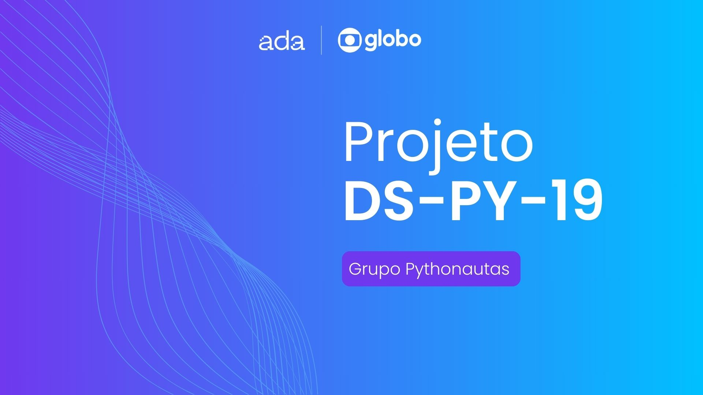
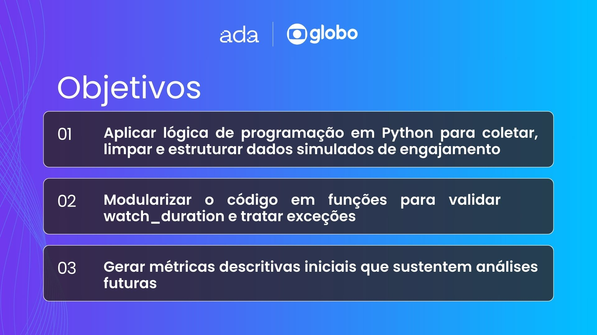
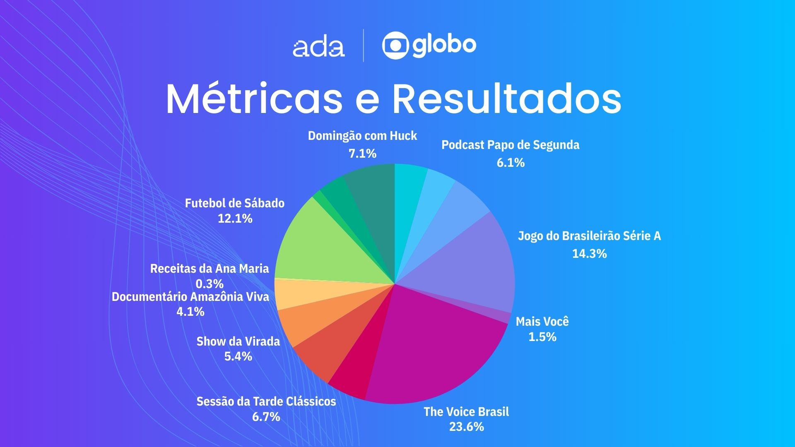
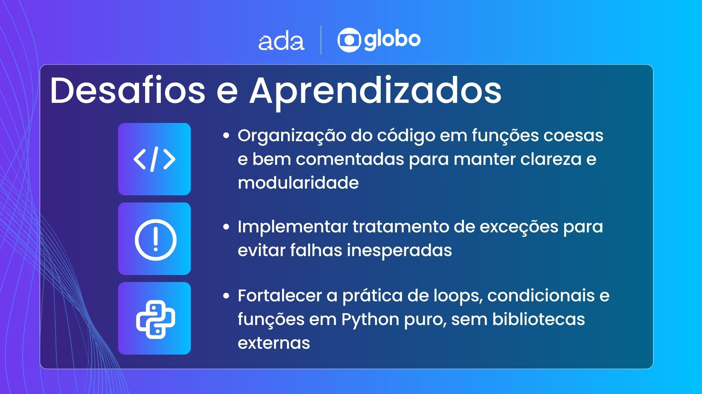
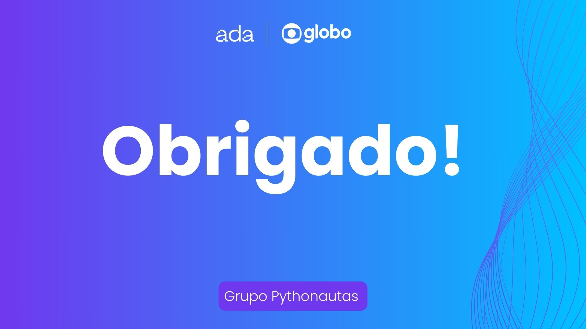

# 🤝 Ada x Globotech — Projeto em Grupo

Este repositório reúne o primeiro projeto desenvolvido em equipe durante o desafio **Ada Tech x Globotech**, uma experiência colaborativa que simula vivências reais do mercado de tecnologia.

Aqui você encontrará o desafios proposto e a solução desenvolvida de forma conjunta pelo nosso grupo ao longo do programa.

---

## 👥 Integrantes do grupo "Pythonautas"

- [@falk-dev](https://github.com/falk-dev)
- [@aliceochoa](https://github.com/aliceochoa)
- [@Williannca85](https://github.com/Williannca85)
- [@devrsmenezes](https://github.com/devrsmenezes)
- [@isabelacmaia](https://github.com/isabelacmaia)
- [@ugabiraposo](https://github.com/ugabiraposo)

---

## 💡 Sobre o repositório

Este repositório tem como objetivo documentar e versionar os projetos realizados em parceria com a Globotech, promovendo o aprendizado prático, o trabalho em equipe e o desenvolvimento de soluções que integram lógica, criatividade e boas práticas de programação.

---

### 📑 Apresentação & Review

Abaixo você encontra os slides que apresentamos durante nossa entrega: os objetivos de aprendizagem, o escopo inicial, as métricas calculadas, os principais desafios que enfrentamos e, por fim, nossos agradecimentos.

---
